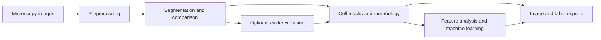

# Cell Segmentation Platform

**An interactive research toolkit for microscopy image segmentation, cell morphology, and machine learning.**


Compare classical image processing and deep learning methods in one workspace. Inspect segmentation masks, combine predictions, extract per-cell features, and export images and tables for downstream analysis.

[Quick start](#quick-start) · [Capabilities](#capabilities) · [Documentation](#documentation) · [Contributing](CONTRIBUTING.md) · [Report an issue](https://github.com/XZhang0726/cell-segment-platform/issues)

## Workflow



## Capabilities

| Area | Available functionality |
| --- | --- |
| Segmentation | Otsu and adaptive thresholding, watershed, Canny edges, Cellpose, a CellViT subprocess integration, a SAM-based wrapper, and a U-Net prediction API |
| Comparison and fusion | Side-by-side comparison, instance matching, Dempster–Shafer evidence fusion, and geometric refinement |
| Batch processing | Multiple-image processing, configurable parallel workers, and ZIP export |
| Cell morphology | Per-cell crops, area and shape measurements, texture features, and CSV export |
| Exploratory analysis | Clustering, PCA/t-SNE/UMAP, feature analysis, and anomaly detection |
| Predictive workflows | Classification and regression, model comparison, active learning utilities, and candidate screening from feature tables |

The main application is `app_enhanced.py`. The Gradio interface (`app.py`) and minimal Streamlit interface (`app_streamlit.py`) are retained as alternative entry points. This repository is under active development; experimental workflows and third-party model integrations require validation on your own data.

## Quick start

Use **Python 3.12** in a dedicated environment; the package requires Python 3.10 or newer. Classical segmentation runs on CPU. CUDA requires a compatible NVIDIA GPU; macOS users should start with CPU execution.

```bash
git clone https://github.com/XZhang0726/cell-segment-platform.git
cd cell-segment-platform
python -m venv .venv
source .venv/bin/activate
python -m pip install --upgrade pip
python -m pip install -r requirements.txt
python -m streamlit run app_enhanced.py
```

On Windows PowerShell, activate the environment with `.\.venv\Scripts\Activate.ps1` instead. You can also use `start-app.bat`, which selects the repository-local `.venv` when present and otherwise uses `python` from your current PATH. Open the local URL printed by Streamlit, usually `http://localhost:8501`.

For CUDA, install the appropriate PyTorch distribution before the remaining dependencies. See the [installation guide](installation.md) for platform-specific setup. `environment.yml`, `requirements_complete.txt`, and `requirements_cellpose_gpu.txt` are historical Windows/CUDA snapshots, not portable installation specifications.

For the optional Gradio interface, install `gradio` and run `python app.py`.

### First analysis

1. Open **Image Segmentation** and upload a microscopy image.
2. Start with **Otsu** or **Watershed** to check the workflow without downloading weights.
3. Review the mask and overlay; adjust preprocessing and segmentation settings.
4. Use **Comparison Mode** to compare methods, or **Cell Morphology Extraction** to inspect individual cells and measurements.
5. Export the results. Machine learning tabs use feature tables and require suitable labels or saved models for their respective workflows.

## Model setup

| Method | Additional requirements | Notes |
| --- | --- | --- |
| Classical methods | Main environment only | Thresholding and edge methods produce binary outputs; watershed produces labeled regions. |
| Cellpose | `cellpose` and compatible PyTorch | First use may download weights. Model names and behavior depend on the Cellpose version. |
| CellViT | Project-local `env_cellvit`, upstream implementation, and compatible checkpoint | Inference runs in a separate Python process. See the [CellViT guide](cellvit-guide.md). |
| SAM-based segmentation | `segment-anything` and a checkpoint under `models/sam/` | The legacy interface label **CellSAM** denotes a Meta SAM automatic-mask wrapper, not a separate cell-trained CellSAM model. See the [SAM guide](sam-guide.md). |
| U-Net | Trained checkpoint for meaningful predictions | Python training and inference components are provided; pretrained weights are not bundled. |

Datasets and model weights are not included. Fusion confidence maps may be generated heuristically from masks and should not be interpreted as calibrated probabilities. See the [technical overview](platform-overview.md) for assumptions and limitations.

## Python API

Run this example from the repository root after installing the dependencies:

```python
import cv2
from src.api.segmentation import CellSegmenter

image = cv2.imread("cell_image.png", cv2.IMREAD_GRAYSCALE)
if image is None:
    raise FileNotFoundError("cell_image.png")

segmenter = CellSegmenter(method="otsu", device="cpu")
mask = segmenter.segment(image)
if not cv2.imwrite("cell_mask.png", mask):
    raise OSError("Could not save cell_mask.png")
```

Supported method names are `otsu`, `adaptive`, `watershed`, `edge_canny`, `cellpose`, `cellvit`, `cellsam`, and `deep_learning`. Outputs vary by method: binary foreground masks, edge maps, or integer instance labels. Preserve instance labels when exporting instance segmentation results.

## Documentation

| Guide | Contents |
| --- | --- |
| [Documentation index](docs/index.md) | Navigation and document status |
| [Installation](installation.md) | Environments, CPU/GPU setup, troubleshooting |
| [Technical overview](platform-overview.md) | Workflows, features, fusion, methodological limitations |
| [CellViT setup](cellvit-guide.md) / [validation](cellvit-testing.md) | Environment, checkpoints, and checks |
| [SAM setup](sam-guide.md) / [validation](sam-testing.md) | Dependencies, checkpoint variants, mask inspection |
| [Architecture](docs/architecture.md) | Module boundaries and execution flow |
| [Roadmap](docs/roadmap.md) | Proposed development phases, priorities, and milestones |

## Repository layout

```text
cell-segment-platform/
├── app_enhanced.py          # Main Streamlit application
├── app.py                  # Gradio interface
├── app_streamlit.py        # Minimal Streamlit interface
├── locales/                # English interface text
├── src/
│   ├── api/                # Unified segmentation interface
│   ├── core/               # Models, segmentation, features, fusion
│   ├── data/               # Image I/O, datasets, augmentation
│   ├── training/           # Training loops, losses, metrics, configuration
│   ├── inference/          # U-Net prediction utilities
│   └── ml/                 # Feature-table analysis and learning
├── tests/                  # Automated tests
├── scripts/                # Data preparation utilities
├── docs/                   # Architecture and development documentation
├── data/                   # Local data; contents ignored by Git
└── models/                 # Local checkpoints; weights ignored by Git
```

## Development

```bash
python -m pip install -r requirements-dev.txt
python -m pytest
```

Root-level `test_*.py` files include demonstrations and hardware-specific diagnostics; some need local images, model weights, or a GPU. They are separate from the default `tests/` suite. See [CONTRIBUTING.md](CONTRIBUTING.md) for development guidance and the [validation record](docs/validation.md) for the checked environment and known test failures.

When [reporting a problem](https://github.com/XZhang0726/cell-segment-platform/issues), include a minimal example, dependency versions, and the complete error message. Use public or synthetic data in public issues.

## Attribution and licensing

This project builds on PyTorch, Streamlit, OpenCV, scikit-image, scikit-learn, Cellpose, CellViT, and Segment Anything. Third-party software and checkpoints retain their respective licenses and citation requirements.

A project license has not yet been supplied. Contact the maintainer before relying on a particular reuse license.
